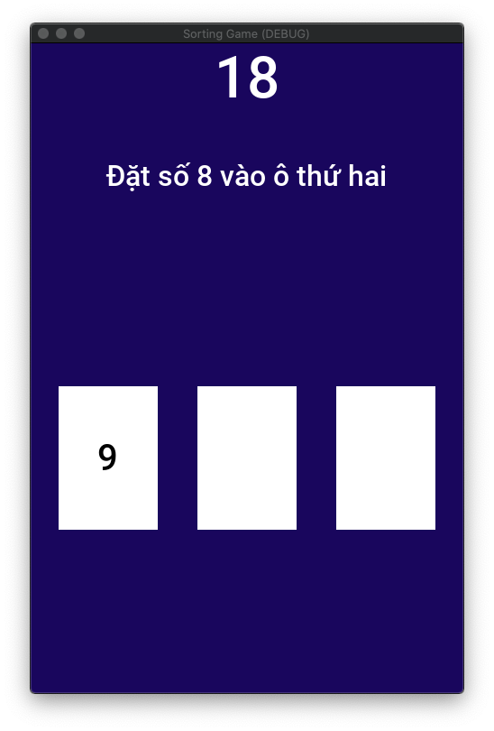

# SORTING GAME

## Motivation

The best way to learn an algorithm is doing it with your hands! In that way even a complex algorithm can be come a fun game for all ages.

## Gameplay

In this game, a player has to follow the instruction on the screen and place the right cards onto the right card readers. Let's see how quick you can finish this game!

Play the video below to grasp what all of this is about.

[](https://youtu.be/1rLfiI8Qr10)

Of course it's not interesting as is. A complet sorting game (featuring bubble sort algorithm for example) with at least some more cards is on the way.

## Pre-requisites

Materials:

* 3 NFC reader modules as in [my multiple-objects detection system](https://github.com/quantranfr/MultiNFC).
* Raspberry Pi (tested with MacOS) or any Linux-like machine.

Softwares and libraries:

* Download, install the open-source game engine [Godot](https://godotengine.org). For Pi:

  * Download Godot's [source code](https://github.com/godotengine/godot/releases/tag/3.2.3-stable);
  * Install Clang 9 [like this](https://solarianprogrammer.com/2018/04/22/raspberry-pi-raspbian-install-clang-compile-cpp-17-programs/);
  * Change the first line of `$(which scons)` file to `#! /usr/bin/python3`;
  * Go to the the source code root folder and compile with `scons platform=x11 use_llvm=yes` as instructed [here](https://docs.godotengine.org/en/stable/development/compiling/compiling_for_x11.html).
  
* Download [MultiNFC](https://github.com/quantranfr/MultiNFC)

## Run the game

Steps to follow to run the game:

* Open the `.project` file in this repository with Godot and run the game (or export it to a standalone application and run).
* Run `python readSerial.py` in MultiNFC.

## Simulation without NFC reader modules

To test this game without having to worry about physical objects, we have to do some simulation. Here are the steps to do it:

* Install `python` and the `websockets` module;
* Run the game;
* Run `python -m websockets ws://127.0.0.1:9080` in your terminal;
* At the prompt, simulate action with the `<reader1:card1>;<reader2:card2>;…` syntax. Note that only readers with a card on it need to be mentioned. For example, the following commands will lead to a win (at the time of writing):

```
R1:62 C9 B1 A9
R1:62 C9 B1 A9;R2:37 5F D1 3C
R1:62 C9 B1 A9;R3:C0 D6 16 32;R2:37 5F D1 3C
R3:C0 D6 16 32;R2:62 C9 B1 A9
R1:37 5F D1 3C;R3:C0 D6 16 32;R2:62 C9 B1 A9
```



## How-to

### Update card IDs

By modifying these lines:

```
var cards = { # number written on cards
	"C0 D6 16 32": "7",
	"37 5F D1 3C": "8",
	"62 C9 B1 A9": "9",
}
```

We can add as many card as we want, whether they will be used in the game or not.

### Update reader IDs

```
var readers = { # position of each reader in the row
	"R1": 0,
	"R2": 1,
	"R3": 2,
}
```

You should ONLY include readers that are used in the game.

## Roadmap

* Make config files to store cardIDs and readerIDs
* Internationalization
* Add more card readers (and also change the sreen to paysage mode)
* Change music

> The assets (audio) are borrowed from [Dodge the Creeps!](https://docs.godotengine.org/en/stable/getting_started/step_by_step/your_first_game.html) - an example game in Godot documentation.
