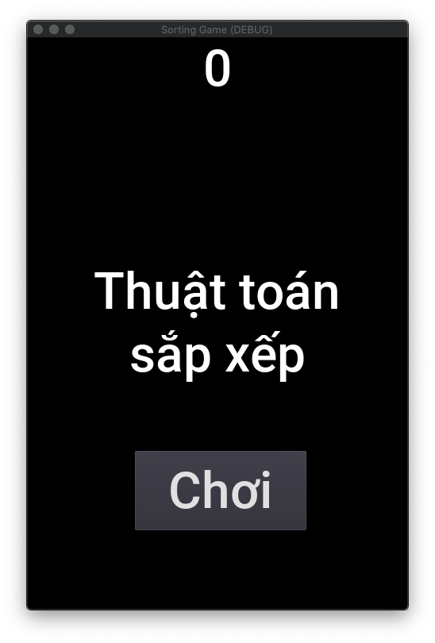

# SORTING GAME



In this game, a player has to follow the instruction on the screen and place the right cards onto the right card readers. Let's see how quick you can finish this game!

Wait… cards and readers? In fact, unlike other computer games, this game is intended to be interactive with the physical world (everyone loves that), so by "cards" and "readers", I mean the real ones: NFC tags and NFC readers. The hardware part (and the code for that) is described in a separate repository.

So to test this game, we have to do some simulation. Here are the steps to do it:

* Install `python` and the `websockets` module;
* Run the game;
* Run `python -m websockets ws://127.0.0.1:9080` in your terminal;
* At the prompt, type `<action>[:<cardID>]:<readerID>` for each card manipulation. For example (leading to a win at the time of writing):

```
> ADD:C9:R0
> ADD:C8:R1
> ADD:C7:R2
> REMOVE:R0
> REMOVE:R1
> ADD:C8:R0
> ADD:C9:R1
```

with `C9` simulating the card number 9 and `R0` is the first reader on the left.


## Context

This educational game is born to serve ExploraScience - the first state-own science center in Vietnam, located in the coastal city of Quy Nhon.

It's made in Godot, an open-source platform for game creation.

> The assets (audio) are borrowed from [Dodge the Creeps!](https://docs.godotengine.org/en/stable/getting_started/step_by_step/your_first_game.html) - an example game in Godot documentation.

## Roadmap

* Make config files to store cardIDs and readerIDs
* Internationalization
* Change music
* Add more card readers (and also change the sreen to paysage mode)
